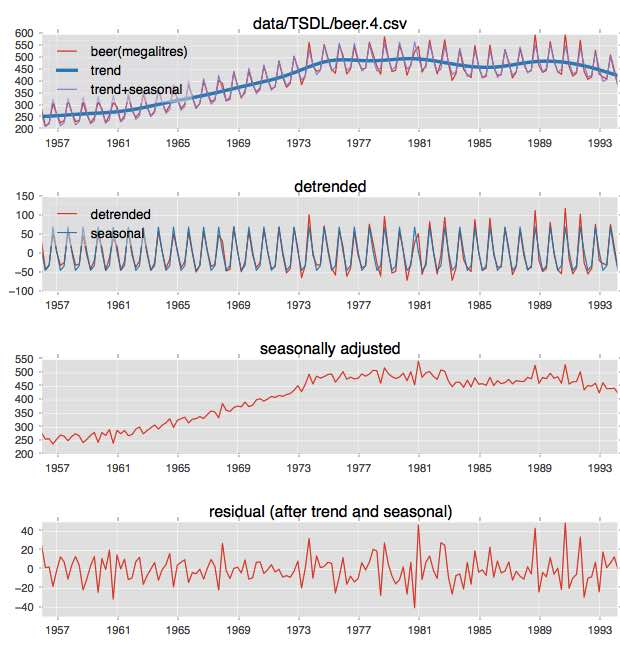
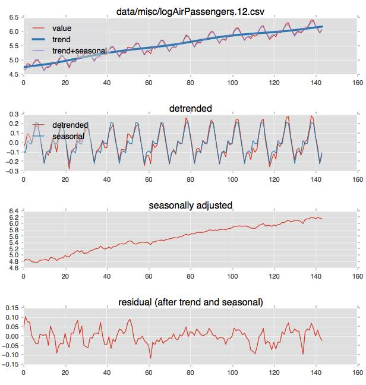
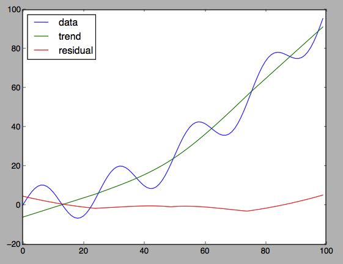
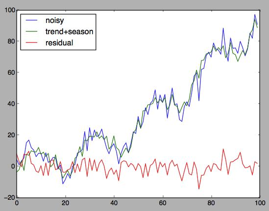

seasonal
========
[![Build Status][travis-image]][travis-url] [![PyPI version][pypi-image]][pypi-url] [![PyPI download][download-image]][pypi-url]

Robustly estimate trend and periodicity in a timeseries.

`Seasonal` can recover sharp trend and period estimates from noisy
timeseries data with only a few periods.  It is intended for
estimating season, trend, and level when initializing structural
timeseries models like Holt-Winters [Hyndman], and its defaults are
biased towards the kinds of training sets found in that setting. Input
samples are assumed evenly-spaced from a continuous-time signal with
noise but no anomalies.

In this package, trend removal is in service of isolating and
estimating periodic (non-trend) variation. "trend" is in the sense of
Cleveland's STL decomposition [Cleveland] -- a lowpass smoothing of
the data that, when removed from the original series, preserves
original seasonal variation.  Detrending is accomplishd by a coarse
fitted spline, mean or median filters, or a fitted line.

The seasonal estimate will be a list of period-over-period averages at
each seasonal offset. You may specify a period length, or have it
estimated from the data. The latter is an interesting capability of
this package.

In an addition to a python API for estimating seasonal offsets for
your timeseries models, the seasonal package also provides executables
to process CSV files from the command line:

  * `seasonal` -- trend and seasonal decomposition
  * `seasonal.trend` -- trend decomposition only
  * `seasonal.periodogram` -- periodogram for raw or detrended data

It is not the aim of this package to construct explanatory models for
complete data sets as these commands do -- you would be _much_ better
served building a proper STL or ARIMA model in R. But these
executables are convenient for exploring seasonal's behavior and for
troubleshooting surprises during use.

Quick Start
-----------

```
> pip install seasonal
> seasonal --demo
```


_(note: you'll need to have matplotlib installed for this demo. It is
not a formal dependency, as it is only needed when commands are given
options that produce graphical output)_

To install in-place so you can run tests and play with the included data sets:
```
> git clone git@github.com:welch/seasonal.git
> cd seasonal
> pip install -e .
> py.test -sv
.... (test output) ...

# let's analyze the classic air passenger data
> seasonal data/misc/logAirPassengers.12.csv
period  %TEV    %EEV    N   cycles  file
12      90.99   89.18   144 12      data/misc/logAirPassengers.12.csv

# specify --plot to get a visualization (or --csv to get csv output)
> seasonal --plot data/misc/logAirPassengers.12.csv
```


Example usage (Python)
------------
```
>>> import numpy as np
>>> from seasonal import fit_seasons, adjust_seasons
>>> import matplotlib.pyplot as plt
>>>
>>> # make a trended noisy sine wave
>>> s = [10 * math.sin(i * 2 * math.pi / 25) + i * i /100.0 for i in range(100)]
>>>
>>> # detrend and deseasonalize
>>> seasons, trend, eev = fit_seasons(s, details=True)
>>> residual = adjust_seasons(s, seasons=seasons)
>>>
>>> # visualize results
>>> plt.figure()
>>> plt.plot(s, label='data')
>>> plt.plot(trend, label='trend')
>>> plt.plot(residual, label='residual')
>>> plt.legend(loc='upper-left')
```

```
>>>
>>> # how about with some noise?
>>> plt.figure()
>>> noisy = s + np.random.normal(0, 5, len(s))
>>> plt.plot(noisy, label='noisy')
>>> residual = adjust_seasons(noisy)
>>> explained = noisy - residual
>>> plt.plot(explained, label='trend+season')
>>> plt.plot(residual, label='residual')
>>> plt.legend(loc='upper-left')
```


See docstrings for `fit_seasons()`, `adjust_seasons()`, `fit_trend()`,
`adjust_trend()` for much more detail. And see
`seasonal/application.py:seasonal_cmd()` for code that creates
various combinations of detrended/deseasonalized series

Seasonal commands
-----------------

Although intended for use from within a python forecasting program,
the package is provided with three executables: `seasonal`,
`seasonal.trend`, and `seasonal.periodogram`. Each of these reads CSV
files and can generate graphical or CSV output.

```
> seasonal -h
Usage: seasonal [options] csv-files...

Summarize trend and seasonality in a timeseries to stderr. The TEV (trend
explained variance) is the in-sample variance removed by detrending. The EEV
(expected explained variance) is the cross-validated out-of-sample detrended
variance explained by seasonality.

Options:
  --version        show program's version number and exit
  -h, --help       show this help message and exit
  --column=COLUMN  csv column to use (name or 0-based index, default
                   rightmost)
  --split=SPLIT    split data at the split*100%  or int(split) point and use
                   the intial segment
  --trend=TREND    trend function (line, mean, median, spline). Default is
                   spline.
  --thresh=THRESH  Periodogram periods must score above thresh*maxscore
                   (default 0.9)
  --minev=MINEV    reject seasonality if it does not explain this percentage
                   of variance. Default is 0.05
  --period=PERIOD  seasonally adjust using this period
  --csv            write adjusted timeseries to stdout as CSV
  -p, --plot       display trend and seasonality using matplotlib

```

```
> seasonal.trend -h
Usage: seasonal.trend [options] csv-files...

Summarize trend in a timeseries to stderr. The %EV (explained variance) is the
in-sample variance removed by detrending.

Options:
  --version        show program's version number and exit
  -h, --help       show this help message and exit
  --column=COLUMN  csv column to use (name or 0-based index, default rightmost
  -p, --plot       display trend results using matplotlib
  --trend=TREND    trending function (line, mean, median, spline). Default is
                   spline
  --period=PERIOD  with --trend, adjust trend while preserving variation at
                   this periodicity (default based on data length)
  --split=SPLIT    split data at the split*100%  or int(split) point and use
                   the intial segment
  --csv            write adjusted timeseries to stdout as CSV

```

```
> seasonal.periodogram -h
Usage: seasonal.periodogram [options] csv-files...

Display a periodogram, optionally detrending first.

Options:
  --version        show program's version number and exit
  -h, --help       show this help message and exit
  --column=COLUMN  csv column to use (name or 0-based index, default
                   rightmost)
  --thresh=THRESH  Retain periods scoring above thresh*maxscore (default 0.9)
  -p, --plot       display using matplotlib
  --trend=TREND    trending function (line, mean, median, spline). If
                   specified, perform an initial detrending using this filter
  --period=PERIOD  with --trend, adjust trend while preserving variation at
                   this periodicity (default based on data length)
  --split=SPLIT    split data at the split*100%  or int(split) point and use
                   the intial segment

```

Theory
------

#### Trend Estimation

When initializing a timeseries model, it is customary to first detrend
the training data by fitting a linear trend.  But linear trend fitting
with periodic data can be hazardous -- the trend you get depends on
where you start and stop in the periodic cycle (as a simple
demonstration, try linear regression on a few cycles of a sine
wave). In this package, if a linear trend is selected, we use a broad
median filter [Tukey] to knock down variations at the maximum expected
period or less, and the Theil-Sen estimator [Sen] to robustly fit a
slope to the result.

More usefully, trend forms other than straight lines can be specified.
"Trend" is in the sense of Cleveland's STL decomposition [Cleveland]
-- a lowpass smoothing of the data that, when removed from the
original series, preserves original seasonal variation. Such
detrending is accomplishd by a coarse fitted spline, mean or median
filters, or a fitted line.

#### Period Estimation

Seasonal offsets are simple to estimate given a period -- they are
period-over-period averages using all the provided data.

Estimating the period itself is less straightforward (though often,
you know the periodicity of your data, so this may not an
issue). Although a variety of techniques exist that operate in the
frequency domain, they lean heavily on sinusoidal decomposition
[Quinn] and don't recover sharp estimates for the short, noisy
sequences we often get in model training sets. This package instead
uses a time-domain approach that accommodates any periodic signal
shape, with additive noise. It tests a range of plausible
periodicities for best fit the detrended data, and is formulated as a
model selection problem.

First, a range of likely periods is estimated via periodogram
averaging [Welch] (no relation to the author).  This is an optional,
ad-hoc optimization. It works well for all our tests and examples, but
there are surely classes of signal or levels of noise that will fool
it.

Next, a time-domain period estimator chooses the best integer period
based on cross-validated residual errors [Hastie]. It also tests the
strength of the seasonal effect using the R^2 of the leave-one-out
cross-validation. For the seasonal model used here, this is the
expected fraction of variance (after detrending) explained by the best
seasonal estimate.

References
----------

* [Cleveland] Cleveland, et al, "STL: A Seasonal-Trend Decomposition Based on
  Loess", http://cs.wellesley.edu/~cs315/Papers/stl%20statistical%20model.pdf
* [Hastie] Hastie, Tibshirani, and Friedman, _The Elements of Statistical
  Learning (2nd ed)_, eqn 7.52, Springer, 2009
* [Hyndman] Hyndman and Athanasopoulosh, _Forecasting: Principles and Practice_,
  https://www.otexts.org/fpp
* [Quinn] Quinn and Hannan, _The Estimation and Tracking of Frequency_,
  Sec. 6.2.3, Cambridge University Press, 2001
* [Sen] P.K. Sen, "Estimates of the regression coefficient based on
  Kendall's tau", J. Am. Stat. Assoc., Vol. 63, pp. 1379-1389, 1968.
* [Tukey] Tukey, J. W., _Exploratory Data Analysis_, Pearson, 1977
* [Welch] Welch, P.D. (1967) "The Use of Fast Fourier Transform for the
  Estimation of Power Spectra: A Method Based on Time Averaging Over Short,
  Modified Periodograms", IEEE Transactions on Audio Electroacoustics,
      AU-15, 70–73.

Dependencies
-------------
package: numpy, scipy
extras:  pandas, matplotlib

[travis-image]: https://travis-ci.org/welch/seasonal.svg?branch=master
[travis-url]: https://travis-ci.org/welch/seasonal
[pypi-image]: http://img.shields.io/pypi/v/seasonal.svg
[download-image]: http://img.shields.io/pypi/dm/seasonal.svg
[pypi-url]: https://pypi.python.org/pypi/seasonal
